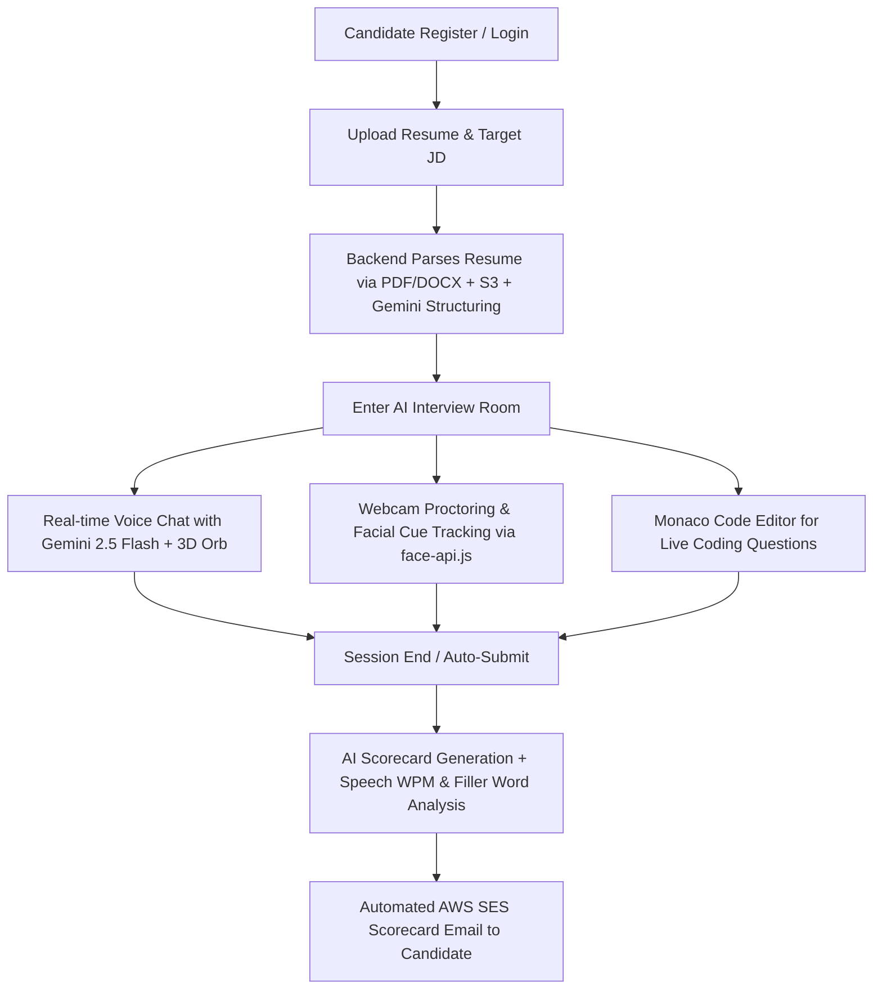

# 🚀 PrepForce AI - Complete Project Overview & Technical Architecture

PrepForce AI is a full-stack, AI-powered mock interviewing and technical preparation platform. It simulates real-time human interviewer interactions using AI voice synthesis, live webcam behavioral tracking, candidate resume/job-description alignment, interactive coding environments, and automated deep-dive feedback scorecards.

---

## 🛠️ Complete Tech Stack

### **Frontend (Client Application)**
* **Framework:** Next.js 16 (React 19, App Router architecture)
* **Language:** TypeScript
* **Styling & UI:** Tailwind CSS v4, Framer Motion (glassmorphism design system & micro-animations), Lucide React icons
* **Code Editor:** `@monaco-editor/react` (VS Code-like in-browser editor for coding assessments)
* **Browser AI & Computer Vision:** `face-api.js` (Webcam facial expression recognition, neutral/smile detection, gaze focus tracking)
* **Voice & Audio Processing:** Web Speech API (`SpeechRecognition` & `SpeechSynthesis`) + Web Audio API (`AudioContext`, `AnalyserNode` for live voice amplitude rendering)
* **PDF Export & DOM Rendering:** `jspdf`, `html2canvas`, `html-to-image`

### **Backend (API Server)**
* **Framework:** Node.js with Express.js 5 (REST API in TypeScript)
* **AI Engine:** Google Gemini 2.5 Flash API (`@google/genai`)
* **Database & Auth:** Supabase (PostgreSQL database with Row-Level Security policies & Supabase Auth Admin API)
* **Security & Traffic Management:** `express-rate-limit` (custom rate limiters for chat, resume upload, and general routes)
* **Document Parsing:** `mammoth` (DOCX parsing) and `pdf-parse` (PDF text extraction)

### **Cloud Services & Integrations**
* **Cloud Storage:** **AWS S3** (`@aws-sdk/client-s3`) for secure resume cloud storage
* **Transactional Email:** **AWS SES** (`@aws-sdk/client-ses`) & **Nodemailer** (for 6-digit OTP authentication emails & automated candidate scorecards)
* **Payment Gateway:** **Razorpay** SDK for processing subscriptions, extra interview packs, and deep-dive unlocks

---

## 💡 Key Features & Workflow (End-to-End)

### 1. **Authentication & Custom OTP Email Verification**
* **OTP Flow:** Candidates register with their email. The backend generates a cryptographically random 6-digit OTP, cached in memory (5-minute TTL), and dispatches an HTML email via Nodemailer/AWS SES.
* **Auto-Confirmation:** Once verified, Supabase Auth creates the user account using the admin service role.

### 2. **Resume Parsing & Job Description Matching**
* Resumes (`.pdf` or `.docx`) are parsed locally to text using `pdf-parse` or `mammoth`.
* Files are uploaded directly to an AWS S3 bucket (`prepforce-resumes`).
* Gemini 2.5 Flash extracts core skills, project experience, and matches candidate background against optional target **Job Descriptions (JDs)**.

### 3. **Real-time AI Voice Interview Room**
* **Dynamic 3D Visualizer:** Features a custom animated AIOrb that switches states (`idle`, `listening`, `thinking`, `speaking`) in sync with audio amplitude.
* **Proctoring System:** Monitors tab visibility (`visibilitychange`). 3 tab switches trigger automatic session termination to enforce integrity.
* **Non-Verbal & Gaze Analytics:** Uses `face-api.js` on the candidate’s webcam feed to track focus levels, neutral expressions, smiles, and distraction flags every 2 seconds.

### 4. **Live Coding Environment**
* Integrated Monaco editor allowing candidates to write solutions in JavaScript/Python during technical rounds. The code snippet is injected directly into Gemini’s memory stream for instant evaluation.

### 5. **Comprehensive AI Feedback & Scorecards**
* **Metric Scores:** Overall score (0-100), Technical Depth, Communication, Confidence.
* **Speech Analytics:** Calculates WPM (Words Per Minute) and counts filler words (*"um"*, *"like"*, *"actually"*, *"so"*).
* **Behavioral Summary:** Synthesizes non-verbal webcam logs into actionable interview posture feedback.
* **Email Dispatch:** Automatically sends an HTML summary email to candidate inbox via AWS SES with a direct link to their report.

### 6. **Admin Mainframe & Control Panel**
* **Financial Analytics:** Live dashboard tracking gross revenue, hosting overheads, variable Gemini API token costs, and net margins.
* **User Management:** Ban/unban accounts, reset interview quotas, delete users.
* **J.A.R.V.I.S Console Subsystem:** Interactive command terminal supporting system commands (`/db users`, `/db interviews`, `/sys stats`, `/sys clean`, `/broadcast`).

---

## 💳 Business & Pricing Model

1. **Free Tier:** Limited to 2 interviews per day and 1 free deep-dive report unlock.
2. **Pro Subscriptions:**
   * **Pro Monthly (₹150/mo):** 70 interviews/month.
   * **Pro Yearly (₹999/yr):** 900 interviews/year.
3. **Pay-As-You-Go Add-ons:**
   * **Extra Interviews Pack:** ₹20
   * **Individual Premium Report Unlock:** ₹30

---

## 🗄️ Database Architecture (`database_schema.sql`)

* **`user_profiles`:** User metadata, plan type (`free`, `pro_monthly`, `pro_yearly`), default coding language, interview quotas remaining (`interviews_left`), role (`user`, `admin`), and status (`active`, `banned`).
* **`interviews`:** Linked to candidates, storing parsed resume JSON context, target role, session status, AI scorecard, and logged behavioral metrics JSON.
* **`messages`:** Chat history for each interview session storing role (`system`, `user`, `model`) and conversation transcripts.
* **`job_templates` & `coding_attempts`:** Support custom employer job templates and candidate code execution attempts.
