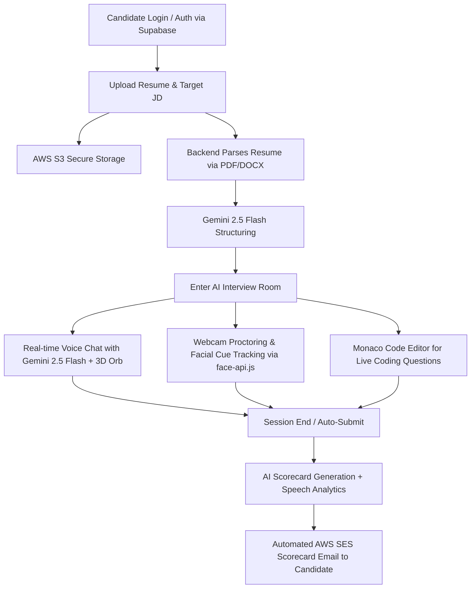

# 🚀 PrepForce AI

PrepForce AI is a full-stack, AI-powered mock interviewing and technical preparation platform. It simulates real-time human interviewer interactions using advanced generative AI (Google Gemini), live webcam behavioral tracking, candidate resume parsing, interactive coding environments, and automated deep-dive feedback scorecards.

---

## 🎯 The Problem & Solution
* **The Problem:** Traditional mock interviews are expensive, difficult to schedule, and often lack objective, data-driven feedback. Candidates struggle to practice for the high-pressure environment of live technical and behavioral interviews.
* **The Solution:** PrepForce AI acts as an on-demand, highly realistic AI interviewer. It tailors questions specifically to a candidate's resume and target job, and provides objective, measurable feedback on both technical accuracy and behavioral confidence.

---

## 🏗️ System Architecture & Workflow



---

## 🛠️ Complete Tech Stack & Engineering Decisions

### 1. Frontend (The Interactive Client)
* **Framework:** **Next.js 16 (React 19, App Router)**. Chosen for its fast server-side rendering (SSR) and optimized edge routing.
* **UI & Aesthetics:** **Tailwind CSS v4** and **Framer Motion**. Used to build a premium "glassmorphism" design and complex micro-animations (like the 3D AI Orb) for an immersive experience.
* **Live Code Editor:** `@monaco-editor/react`. Embeds the VS Code engine directly into the browser, allowing candidates to write and execute JavaScript/Python live.
* **Browser AI (Computer Vision):** `face-api.js`. Processes webcam feeds *locally* in the browser to track facial expressions and eye gaze, saving massive backend server costs.

### 2. Backend (The Secure API Server)
* **Architecture:** **Node.js with Express.js 5 (TypeScript)**. Handles heavy, asynchronous tasks like file uploads and AI streaming without blocking the server.
* **Document Parsing Engine:** Uses `multer` for file handling, `pdf-parse` (PDFs), and `mammoth` (DOCX) to extract raw text from resumes for the AI to read.
* **Security & Traffic:** `express-rate-limit` prevents malicious bots from spamming the API and racking up AI token bills.

### 3. Database & Auth
* **Supabase (PostgreSQL):** A robust relational database managing `user_profiles`, `interviews`, and `messages`. 
* **Security (RLS):** Implements Row-Level Security (RLS) so candidates can only query and view their *own* interview scorecards, preventing data leaks.

### 4. Cloud Infrastructure & AWS
* **Storage (AWS S3):** Uploaded resumes bypass the main backend server and are piped directly to an infinitely scalable AWS S3 bucket.
* **Transactional Email (AWS SES):** Ensures 6-digit OTP login emails and automated HTML/PDF feedback scorecards reach the user's inbox instantly without hitting spam filters.

### 5. AI Strategy: The Gemini Engine
* **Google Gemini 2.5 Flash:** Because latency ruins a voice interview, we use Gemini 2.5 Flash for its ultra-fast inference times and large context windows (perfect for reading 3-page resumes).
* **AI-Agnostic Architecture:** The backend uses the standard `openai` SDK mapped to Gemini's OpenAI-compatible endpoint. This future-proofs the app, allowing us to swap the underlying model (e.g., to xAI's Grok or OpenAI's GPT-4) simply by changing an API key in the `.env` file!

---

## 💻 Admin Mainframe (J.A.R.V.I.S Console)
The platform features an embedded "God Mode" dashboard for administrators:
- **Interactive Terminal:** Run commands like `/db users` or `/sys stats` directly from the web browser.
- **Diagnostic Macros:** 1-click buttons to verify the DB Pool, sniff the node registry, or check server runtime health without needing to log into cloud dashboards.

---

## 🏃‍♂️ Getting Started (Local Development)

### Prerequisites
* Node.js (v20+)
* Supabase Account
* AWS Account (S3, SES credentials)
* Google Gemini API Key

### Installation Steps

1. **Clone the repository:**
   ```bash
   git clone https://github.com/Nayansinha2021/PrepForce-AI.git
   cd PrepForce-AI
   ```

2. **Install Backend Dependencies:**
   ```bash
   cd backend
   npm install
   ```

3. **Install Frontend Dependencies:**
   ```bash
   cd ../frontend
   npm install
   ```

4. **Environment Variables:**
   * Create a `.env` file in the `backend/` directory with the following keys:
     ```env
     PORT=8000
     SUPABASE_URL=your_supabase_url
     SUPABASE_SERVICE_ROLE_KEY=your_supabase_service_role
     GOOGLE_API_KEY=your_gemini_api_key
     AWS_ACCESS_KEY_ID=your_aws_key
     AWS_SECRET_ACCESS_KEY=your_aws_secret
     AWS_REGION=ap-south-1
     AWS_BUCKET_NAME=prepforce-resumestore
     ```
   * Create a `.env.local` file in the `frontend/` directory with your public keys.

5. **Run the Development Servers:**
   ```bash
   # Terminal 1: Start Backend (Runs on http://localhost:8000)
   cd backend && npm run dev
   
   # Terminal 2: Start Frontend (Runs on http://localhost:3000)
   cd frontend && npm run dev
   ```

---

## ☁️ Cloud Deployment

The application is fully containerized and deployed across multiple cloud providers for maximum scalability:

- **Frontend:** Hosted on **Vercel** for optimal Next.js edge performance and global CDN caching.
- **Backend:** Hosted on **Render**, providing a reliable, scalable Node.js container environment.
- **Database:** Managed by **Supabase Cloud** (PostgreSQL).
- **File Storage:** **AWS S3**.
- **Email Delivery:** **AWS SES**.

---
*Built with ❤️ by the PrepForce Engineering Team.*
